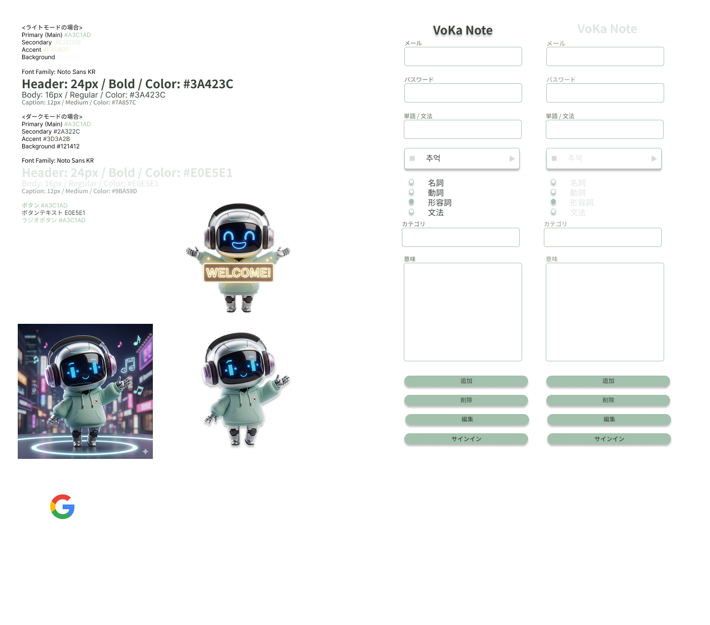
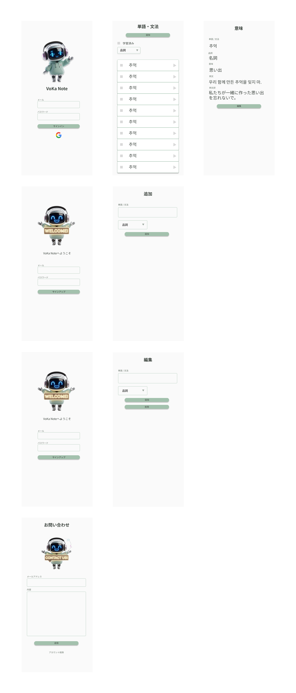

# vokanote - AI単語帳フロントエンド (FlutterFlow)

**vokanote** は、FlutterFlowで構築された「直感的な操作」と「AIによる学習支援」を融合させた、韓国語学習者向けの単語帳アプリケーションです。

## ✨ 特徴 (User Experience)

ユーザーが「単語を入力するだけ」で学習が完結する体験を目指しました。
- **ノンストップ登録**: 単語を入力すると、裏側でGo APIが例文生成と音声合成を同時に行い、学習リストへ追加します。
- **ネイティブ音声再生**: 生成された例文をワンタップで再生。視覚と聴覚の両方で記憶に定着させます。
- **洗練されたUI/UX**: モダンで学習に集中できるインターフェースをFigmaから一貫して設計。

---

## 🎨 デザイン設計 (Figma)

実装前にFigmaを用いてUI/UXデザインを完備。

- [👉 Figma デザインデータ (コンポーネント)](https://www.figma.com/design/rKQ75yyiuT311pahTTqXTx/%3C%E3%83%9D%E3%83%BC%E3%83%88%E3%83%95%E3%82%A9%E3%83%AA%E3%82%AA%3EVoKa-Note-%E4%BB%AE-?node-id=2002-5&t=yo2HchfhY7WaF9Eo-1)

- [👉 Figma デザインデータ (プロトタイプ)](https://www.figma.com/design/rKQ75yyiuT311pahTTqXTx/%3C%E3%83%9D%E3%83%BC%E3%83%88%E3%83%95%E3%82%A9%E3%83%AA%E3%82%AA%3EVoKa-Note-%E4%BB%AE-?node-id=2002-79&t=yo2HchfhY7WaF9Eo-1)

---

## 🏗️ フロントエンド構成

| 役割 | 使用技術 / ツール |
| :--- | :--- |
| **開発プラットフォーム** | FlutterFlow |
| **デザインツール** | Figma |
| **フレームワーク** | Flutter (Dart) |
| **認証 / 連携** | Firebase Auth / REST API |

---

## 🛠️ FlutterFlowでの工夫ポイント

### カスタムAPIアクションの統合
独自に構築した **Goバックエンド（Cloud Run）** と連携。
- APIリクエスト時に **Firebase ID Token** をヘッダーに付与し、フロント・バック間のセキュアな通信を担保しています。

---

## 📲 実機での動作確認 (APK Download)

Android実機で動作を確認いただけるパッケージを用意しています。

- [👉 vokanote v1.0.0 (APK) をダウンロード](https://github.com/Yoshiki-programming/vokanote-flutterflow/releases/download/v1.0.0/VoKaNote-Portfolio-release.apk)

> **⚠️ インストール時の注意**
> 本アプリは開発用パッケージ（ストア外配信）のため、Android端末で警告が表示される場合があります。

---

## 🔗 関連リポジトリ / プロジェクト
本アプリの設計と実装を確認いただけます。

- **Backend (Go)**: [vokanote-backend](https://github.com/Yoshiki-programming/vokanote-backend)
- **FlutterFlow Project**: [👉 エディタでプロジェクトを見る](https://app.flutterflow.io/project/va-ka-note-portfolio-odzcag)

---

## 👨‍💻 Author
**Kamada Yoshiki**
